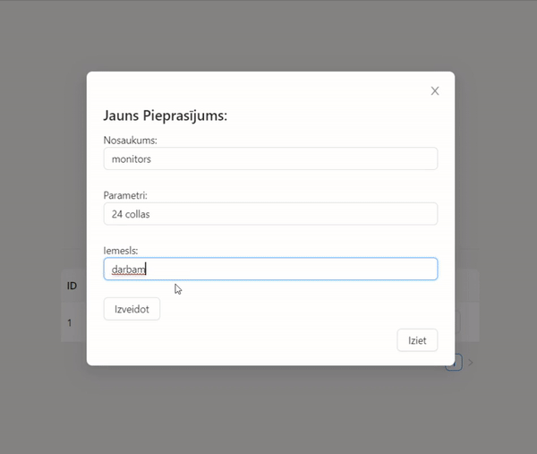

## Computer component request app

### Description

WEB app that allows to enter new computer component requests, save them, delete them, and change their status.



### Setup

First, clone this repository. Then, go to the directory where the project was previously cloned, open back-end package and run the following command at your Windows command prompt.
```
gradlew build
```
Or if you’re working in a Linux/Mac environment, it’s this.
```
./gradlew build
```
To build the front-end part of this project, go to the front-end package and run the following commands.
```
next build

npm install antd

npm run dev
```
Lastly, you will need to create a Docker container. Run those in command prompt
```
docker pull postgres

docker run --name components -p 5432:5432 -e POSTGRES_USER=postgres -e POSTGRES_PASSWORD=postgres -d postgres
```
Finally, run the `gradlew` file and open [http://localhost:3000](http://localhost:3000) with your browser to see the result.

### Tests

Run all tests using the command 
```
./gradlew test
```
